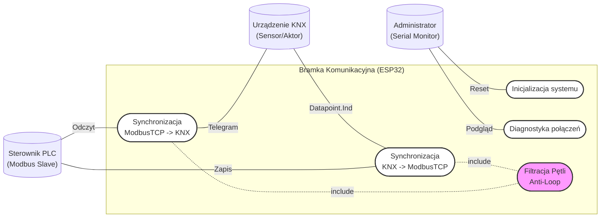

# Bramka Komunikacyjna Modbus TCP ↔ KNX (ESP32 + BAOS 832)


Projekt inżynierski realizujący dwukierunkową bramkę komunikacyjną integrującą systemy automatyki budynkowej (**KNX**) ze standardem przemysłowym (**Modbus TCP**). Urządzenie oparte jest na mikrokontrolerze **ESP32-S3** oraz module sprzętowym **Weinzierl KNX BAOS 832**.

---

## Spis treści
1. [Opis projektu](#-opis-projektu)
2. [Funkcjonalności](#-funkcjonalności)
3. [Architektura Sprzętowa](#-architektura-sprzętowa)
4. [Architektura Oprogramowania](#-architektura-oprogramowania)
5. [Konfiguracja i Uruchomienie](#-konfiguracja-i-uruchomienie)
6. [Autorzy](#-autorzy)

---

## Opis projektu

Celem projektu było stworzenie mostu (Gateway) umożliwiającego wymianę danych między sterownikami PLC (Modbus Master/Slave) a urządzeniami wykonawczymi KNX (np. oświetlenie, rolety). System rozwiązuje problem braku bezpośredniej interoperacyjności między tymi standardami.

Rozwiązanie wykorzystuje **ESP32** jako klienta Modbus TCP (Master) oraz sterownik interfejsu UART dla modułu **BAOS 832**, który zapewnia dostęp do magistrali KNX TP.

---

## Funkcjonalności

* **Dwukierunkowa translacja:**
    * `Modbus -> KNX`: Cykliczne odpytywanie rejestrów PLC i wysyłanie zmian na magistralę KNX.
    * `KNX -> Modbus`: Asynchroniczny odbiór indykacji z KNX i natychmiastowy zapis do rejestrów PLC.
* **Funkcja "Send-on-Change":** Redukcja ruchu sieciowego poprzez wysyłanie telegramów tylko w momencie faktycznej zmiany wartości.
* **Filtracja Pętli (Anti-Loop):** Zaawansowany algorytm zapobiegający oscylacjom sygnałów (echo) przy sterowaniu z dwóch stron jednocześnie.
* **Obsługa typów danych:**
    * Wartości binarne (1-bit / Coils).
    * Wartości 2-bajtowe (2-byte / Holding Registers).
* **Diagnostyka:** Podgląd ramek FT1.2 i statusów połączeń na porcie szeregowym (Serial Monitor).

---

## Architektura Sprzętowa

Schemat połączeń zrealizowanego stanowiska:

* **Mikrokontroler:** Espressif ESP32-S3 (DevKitC-1)
* **Interfejs KNX:** Weinzierl KNX BAOS Module 832
* **Komunikacja:** UART (FT1.2 framing, 19200 baud, 8E1)
* **Zasilanie:** 3.3V (esp32), 29V DC (magistrala KNX)

### Schemat ideowy


---

## 💻 Architektura Oprogramowania

Oprogramowanie napisane w **C++ (Arduino Framework)**. Kluczowe elementy logiki:

### Diagram Przypadków Użycia

---
## Konfiguracja i Uruchomienie
### Wymagania
* Software: Arduino IDE, ETS6 (dla konfiguracji BAOS).
* Biblioteki Arduino:
    * `ModbusIP_ESP8266` (emelianov/modbus-esp8266)
    * `WiFi`
### Konfiguracja mapowania
Konfiguracja odbywa się w pliku `main.ino` w funkcji `configureSlaves();`
```cpp
// Przykład: Mapowanie Rejestrów Holding (0-19) na Datapointy KNX (1-19)
slaves[0].ip = IPAddress(192, 168, 1, 100); // IP sterownika PLC
slaves[0].maps[0].modbusStartAddr = 0;      // Adres startowy Modbus
slaves[0].maps[0].knxStartDp = 1;           // ID startowe KNX Datapoint
slaves[0].maps[0].registerType = 3;         // 3 = Holding Register
slaves[0].maps[0].readFromSlave = true;     // Modbus -> KNX
slaves[0].maps[0].writeToSlave = true;      // KNX -> Modbus
```
### Konfiguracja ETS6
Należy zaprogramować moduł BAOS 832 w ETS6, ustawiając odpowiednie typy danych w DPT oraz adresy grupowe.
---
## Autorzy
Konrad Zarzecki 
Politechnika Wrocławska 
Wydział Informatyki i Telekomunikacji 
Kierunek: Informatyczne Systemy Automatyki

Opiekun pracy: Dr hab inż. Adam Ratajczak
---
Projekt zrealizowany jako praca inżynierska (2025).
